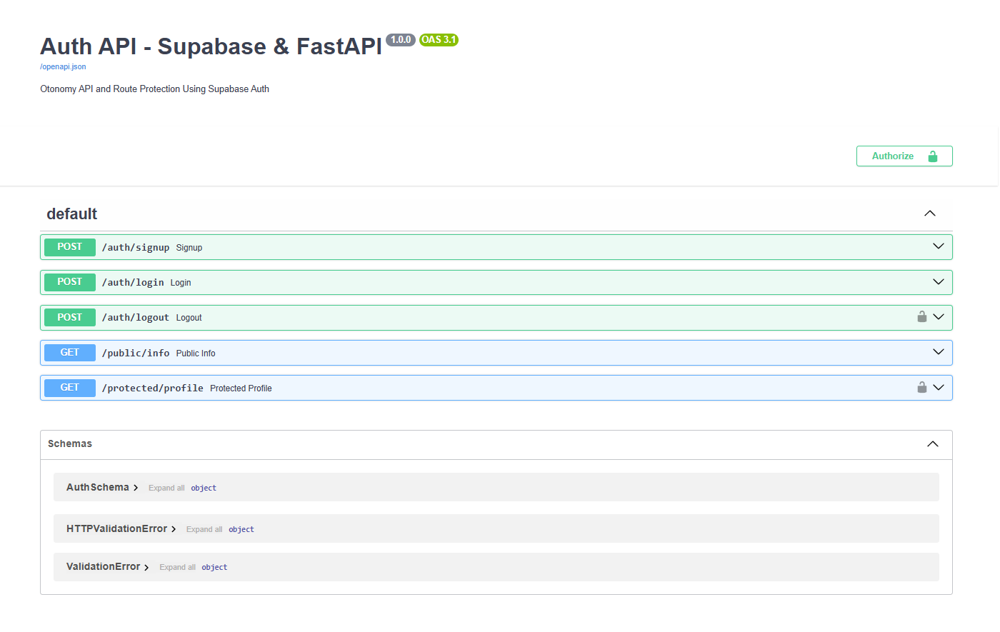
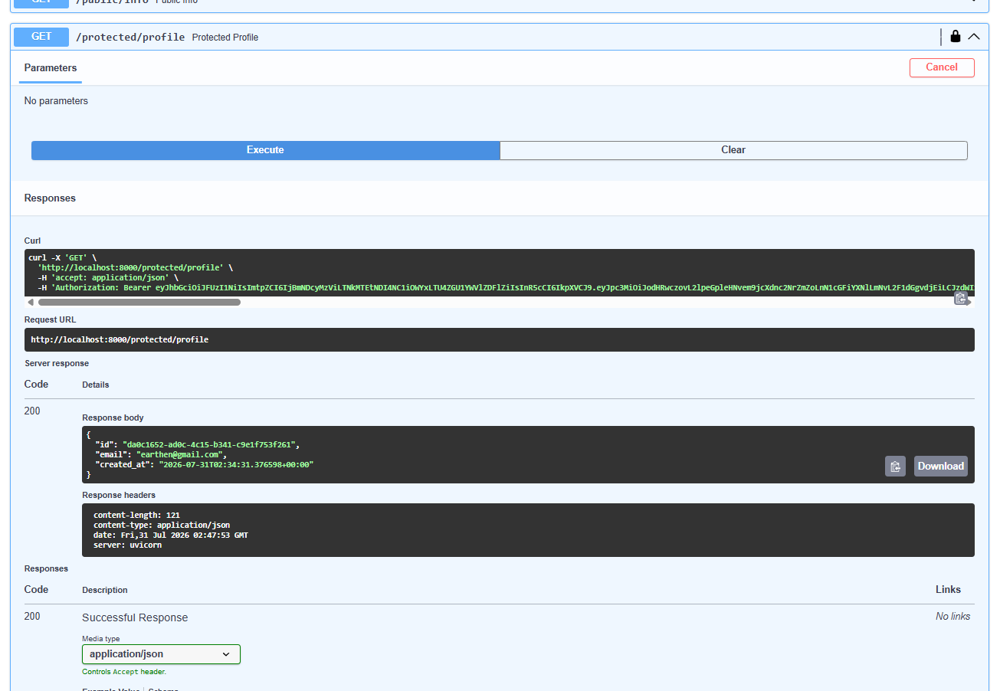

# FastAPI Supabase Auth API

A lightweight and secure authentication REST API built with **FastAPI** and integrated with **Supabase Auth** (GoTrue). This project demonstrates complete user authentication flows, token verification middleware, and route protection using Bearer JWT tokens.

## Features

- **User Authentication**: Sign Up, Log In, and Log Out endpoints.
- **Route Protection**: Middleware dependency to verify Supabase JWTs in request headers.
- **Auto-normalization**: Automatically cleans and normalizes Supabase URLs to prevent path issues.
- **Swagger Documentation**: Self-documenting API with built-in support for Bearer Auth.

---

## Environment Setup

1. Create a `.env` file in the root directory (you can copy the structure from `.env.example`):
   ```env
   SUPABASE_URL=https://your-project-id.supabase.co
   SUPABASE_KEY=your-supabase-anon-key
   PORT=8000
   ```

2. Install the required dependencies:
   ```bash
   pip install fastapi uvicorn supabase python-dotenv "pydantic[email]"
   ```

---

## How to Run the Server

Start the development server using Uvicorn:
```bash
uvicorn main:app --reload
```

Once running, you can access:
- **API Documentation (Swagger UI)**: [http://127.0.0.1:8000/docs](http://127.0.0.1:8000/docs)
- **API Documentation (Redoc)**: [http://127.0.0.1:8000/redoc](http://127.0.0.1:8000/redoc)

---

## API Endpoints

| Method | Endpoint | Auth Required | Description |
| :--- | :--- | :---: | :--- |
| `POST` | `/auth/signup` | No | Register a new user with email and password |
| `POST` | `/auth/login` | No | Authenticate user and retrieve JWT access token |
| `POST` | `/auth/logout` | **Yes** | Log out the user and invalidate the session |
| `GET` | `/public/info` | No | Fetch public information (no token required) |
| `GET` | `/protected/profile` | **Yes** | Fetch authenticated user profile details |

---

## Screenshots

### Swagger UI API Docs


### Accessing Protected Profile

